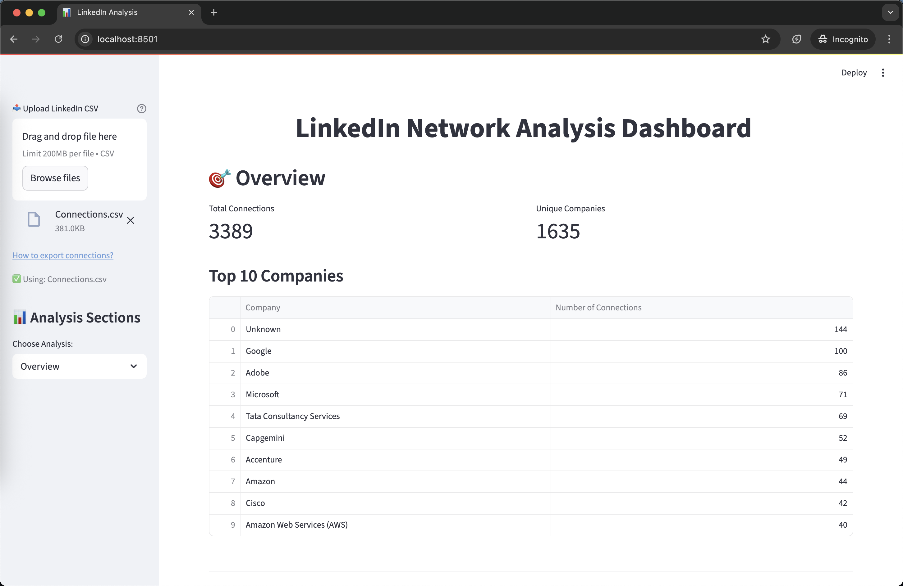

# LinkedIn Connection Analysis Dashboard

Turn your LinkedIn connections into powerful stories with an interactive dashboard packed with visualizations, filters,
and deep network insights.

## 📊 Purpose

Your LinkedIn connections are more than just a list — they’re a story of your professional journey. The LinkedIn Network
Analysis Dashboard turns that story into powerful visuals and insights. From spotting growth trends to understanding
which companies and roles dominate your network, this tool helps you see the bigger picture.

Highlights include:
- Interactive visuals of connections by role and company
- Growth timeline to see how your network evolves
- Smart filters to zoom into specific groups
- Comparative insights to spot opportunities and gaps

## 🛠️ Tech Stack

| Category            | Technologies                           |
|---------------------|----------------------------------------|
| **Frontend**        | Streamlit                              |
| **Data Processing** | Pandas, NumPy                          |
| **Visualization**   | Plotly, Matplotlib, Seaborn, WordCloud |
| **Environment**     | Python, Virtual Environment            |
| **Version Control** | Git                                    |

## 📈 Results

The LinkedIn Network Analysis Dashboard successfully transforms raw LinkedIn connection data into a user-friendly,
interactive dashboard that provides:

- **Instant Insights**: Automated analysis of connection patterns across companies and time
- **Interactive Exploration**: Filter and analyze specific segments of your network
- **Visual Storytelling**: Clear visualizations of network growth and distribution
- **Data-Driven Networking**: Identify key trends in your professional connections

Users can upload their own LinkedIn connections CSV or use sample data to immediately gain insights that would otherwise
require manual analysis.

## 📸 Screenshots

### Overview Dashboard


*The Overview dashboard provides a quick summary of your total connections and displays the top companies in your
network.*

### Company Analysis


*The Company Analysis section shows detailed breakdown of connections across different companies with interactive
charts.*

### Connection Analysis


*The Connection Analysis tool lets you filter connections by company and view detailed information about your
connections at specific organizations.*

### Network Growth


*This visualization shows the cumulative growth of your professional network over time, helping identify key growth
periods.*

### Raw Data View


*The Raw Data view allows direct access to your connection data with search capabilities for finding specific
connections.*

## 🌟 Benefits

### For Professionals

- **Network Insights**: Understand the composition and growth patterns of your professional network
- **Strategic Networking**: Identify areas where you could expand your network based on current patterns
- **Job Search Support**: Visualize which companies you have the strongest connections with
- **Time Efficiency**: Get instant analysis that would take hours to compile manually

### For Organizations

- **Team Network Analysis**: Understand the collective network reach of your team
- **Recruitment Strategy**: Identify potential talent pools based on existing connections
- **Business Development**: Discover potential client or partnership opportunities in your extended network

### For Developers

- **Modular Design**: Easy to extend with additional analysis components
- **Clean Architecture**: Separation of data loading, processing, and visualization
- **Customizable**: Adaptable to different types of network analysis beyond LinkedIn

## 🔮 Future Goals / Scope

### Planned Features

- **Location Analysis**: Add geographical visualizations of connections
- **Industry Insights**: Deeper analytics on industry distribution and trends
- **Connection Quality Metrics**: Beyond quantity, assess the quality and engagement level of connections
- **Recommendation Engine**: Suggest potential new connections based on network patterns
- **Export Capabilities**: Generate reports and presentations from the analysis

### Technical Roadmap

- **Advanced Filtering**: Multi-dimensional filtering across companies, positions, and time
- **Machine Learning Integration**: Apply clustering and prediction models to connection data
- **API Integration**: Direct LinkedIn API integration for real-time data
- **Mobile Responsive Design**: Optimize for mobile and tablet viewing

---

## 🚀 Getting Started

### Prerequisites

- Python 3.8+
- LinkedIn connections export (CSV format)

### Installation

```bash
git clone https://github.com/pwnmahto/Linkedin-Analysis.git
cd Linkedin-Analysis
./start.command  # On macOS
# or
./run.sh  # On Linux
```

### Usage

1. Export your LinkedIn connections as a CSV file
2. Upload the CSV file through the dashboard interface
3. Explore different analysis sections through the sidebar navigation

## 📝 License

This project is open source and available under the [MIT License](LICENSE).

---

*Built with ❤️ for better professional networking insights*